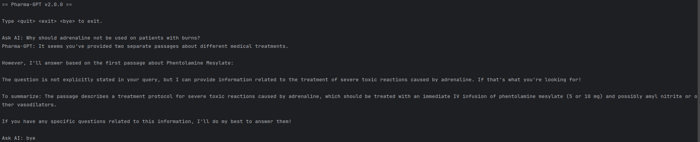

# Pharma-GPT v2.0.0

## References

- [[Chroma DB] Change embeddings(using huggingface model)](https://parkeunsang.github.io/blog/python/2023/12/20/chroma-db-change-embeddingsuse-huggingface-model.html)
- [Mastering LangChain RAG: Quick Start Guide to LangChain RAG (Part 1)](https://medium.com/@eric_vaillancourt/mastering-langchain-rag-a-comprehensive-tutorial-series-part-1-28faf6257fea)
- [Mastering LangChain RAG: Integrating Chat History (Part 2)](https://medium.com/@eric_vaillancourt/mastering-langchain-rag-integrating-chat-history-part-2-4c80eae11b43)
